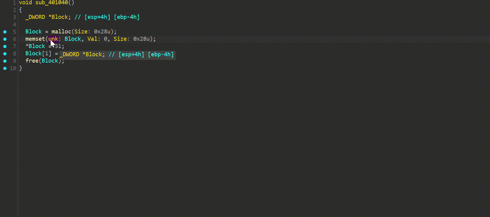
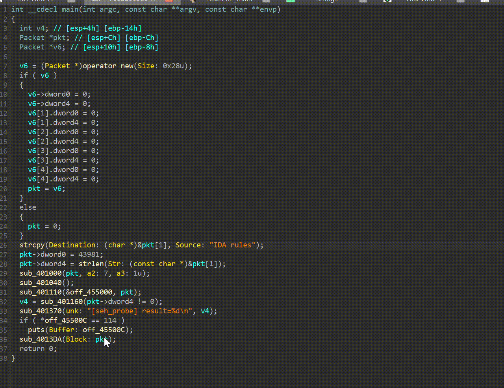
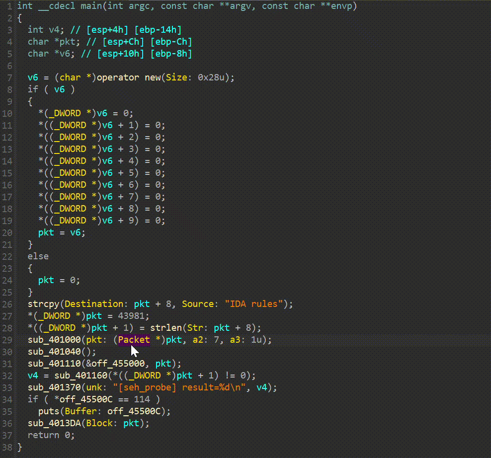
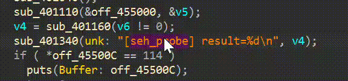
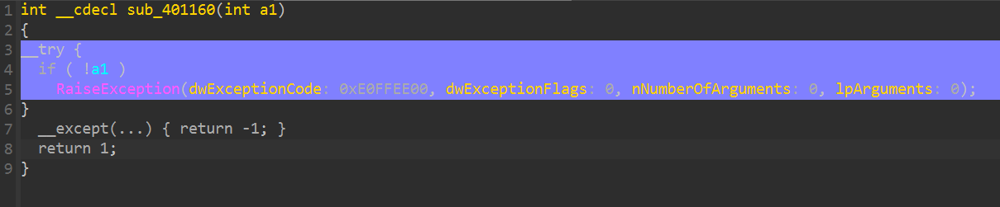
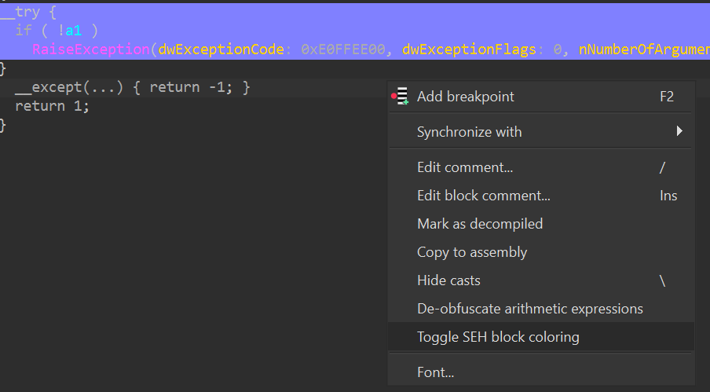

# HappyIDA
Make your IDA Happy will also make you Happy!

HappyIDA is an IDAPython plugin that adds a set of convenience hooks and UI helpers to the Hex‑Rays decompiler.
It offers multiple functionalities:

- Function parameter labeling – Swift‑style labels, rename / type edits at the call site.
- Clipboard helpers – copy / paste names, types, and assign types directly from the clipboard.
- Function navigation – double‑click on a vtable name to jump or search for the matching function.
- Try catch block support (SEH) – visual highlights and try...catch clause rebuild support.
- Rust string handling – automatically pretty‑prints Rust strings in decompiled pseudocode.

## Installation

1. IDA Pro 9.0 or later (Hex‑Rays must be enabled).
2. Directly clone this repo to your IDAPython plugins directory (usually ~/.idapro/plugins/)
3. Restart IDA

## Plugin Structure

```
HappyIDA/
├─ ida-plugin.json                # IDA metadata (plugin name, author)
├─ main.py                        # Loader stub for IDA
├─ demo.cpp                       # Example C++ file for demo
├─ images/                        # README screenshots and GIFs
└─ ida_happy/                     # Core package
    ├─ __init__.py                # Plugin class and action registration
    ├─ miscutils.py               # Helpers (logging, type parsing, tags)
    ├─ undoutils.py               # Undo wrappers and status enum
    └─ modules/                   # Individual feature modules
        ├─ argument_labeler/
        │   ├─ __init__.py
        │   ├─ label.py
        │   ├─ edit.py
        │   ├─ sync_name.py
        │   └─ sync_type.py
        ├─ func_navigate.py
        ├─ rust_string.py
        └─ seh/
            ├─ __init__.py
            ├─ highlight.py
            └─ rebuild.py
```

### Modules

| Module | Functionality |
|--------|----------------|
| argument_labeler | Adds Swift‑style parameter labels, rename and retype directly at call sites. |
| func_navigate | Double‑click vtable name → jump or search for matching function. |
| rust_string | Detects Rust binaries and pretty‑prints string literals in pseudocode. |
| seh | Highlights structured exception handling blocks and rebuilds SEH try catch clause. |

## Features & Usage

| Feature | How to use |
|---------|------------|
| Copy / Paste Name | happyida:hx_copyname (copy) / happyida:hx_pastename (paste). |
| Copy / Paste Type | happyida:hx_copytype / happyida:hx_pastetype. |
| Edit Parameter | Press Y in a function call when the cursor is on an argument. Choose Rename or Set Type. |
| Assign Clipboard Type | Highlight an expression, press Ctrl+Shift+T → Paste type. |
| Navigate Functions | Double‑click on a vtable entry or member pointer in pseudocode. |
| Rust String Pretty Print | Open a Rust binary – strings automatically colorized in Hex‑Rays. |
| SEH Highlight | SEH blocks are visually highlighted; right‑click → Rebuild SEH. |

### Parameter labeling

Swift‑style labels are injected directly into call sites so argument intent is clear without jumping to the prototype.

No more memorizing parameters or bouncing back and forth.

Labels stay out of the way when the argument name and type already match the parameter.


### Edit Parameter

Use IDA's native `N` (rename) or `Y` (set type) while the cursor is on a label. HappyIDA routes those actions to the function parameter instead of the call-site variable.

Double-click a label to push the parameter name down to the argument. The label hides itself once the argument already matches the parameter name and type.



Bonus: double-click an argument name to push it back into an unknown function parameter.



Bonus: double-click a type cast to push the parameter type down to the argument when they differ. Type sync follows the same flow as name sync.



### Copy / Paste Name

Press `C` (`happyida:hx_copyname`) to grab the highlighted identifier to the system clipboard, then press `V` (`happyida:hx_pastename`) to rename the current variable or function to that value.

It shines when a debug string exposes a function/variable name you want to reuse, or when diffing two IDA instances side by side. Copy in one window and paste-rename in the other.




### Copy / Paste Type 


### SEH Highlight

IDA already understands C++ try/catch, but SEH often decompiles without the missing `__except` block. HappyIDA highlights SEH `__try` regions in the pseudocode and rebuilds the corresponding `__except(...)` so the flow is visible again.

Example output after rebuild:
```
int __cdecl sub_401160(int a1)
{
  __try {
    if ( !a1 )
      RaiseException(dwExceptionCode: 0xE0FFEE00, dwExceptionFlags: 0, nNumberOfArguments: 0, lpArguments: 0);
  }
  __except(...) { return -1; }
  return 1;
}
```


You can toggle SEH highlighting from the pseudocode context menu (right-click).


Highlight color is set in `ida_happy/modules/seh/highlight.py` via `bgcolor`, tweak it if you want a different tint.


## License

Licensed under the GPL license. See LICENSE for details.
