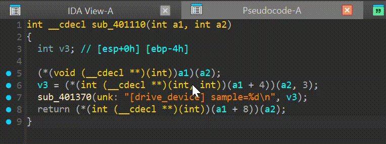
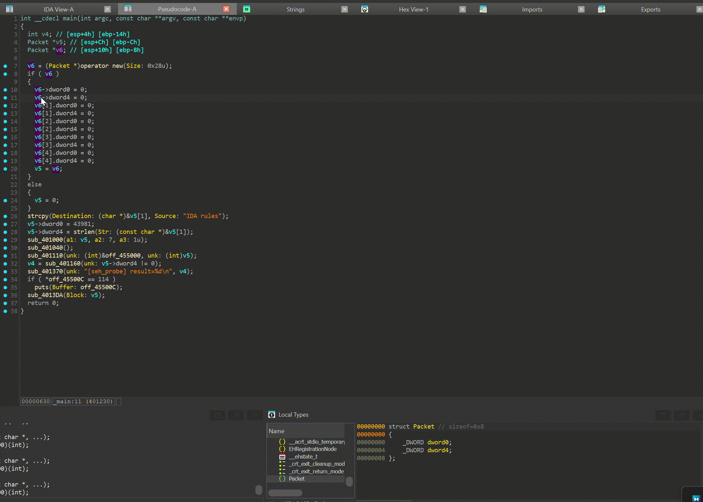

# HappyIDA
Make your IDA Happy will also make you Happy!

HappyIDA is an IDAPython plugin that adds a set of convenience utilities to the Hex‑Rays decompiler. It offers multiple functionalities:

- **Function parameter labeling** – Swift‑style labels, rename / type edits at the call site.
- **Clipboard helpers** – copy / paste names, types, and assign types directly from the clipboard.
- **SEH try/catch block support** – visual highlights and reconstruct try...catch clause in pseudocode view.
- **Function navigation** – double‑click on a vtable name to jump or search for the matching function.
- **Rust string prettifier** – automatically pretty‑prints Rust strings in decompiled pseudocode.

## Installation

### Prerequisites

IDA Pro 9.0 or later (with Hex‑Rays support).

### Method 1: Using hcli (Recommended)

Install using Hex-Rays official plugin manager:

```bash
hcli plugin install HappyIDA
```

This will automatically download and install the plugin to your IDA plugins directory.

### Method 2: Manual Installation

1. Install the Python dependency: `pip install ida-settings`
2. Clone this repo directly to IDA Pro plugins directory (usually `~/.idapro/plugins/`)
3. Restart IDA

## Configuration

HappyIDA can be customized using `hcli` plugin configuration commands. All features are enabled by default, but you can selectively enable or disable individual features.

To view available settings:
```bash
$ hcli plugin config HappyIDA list
 Key                     Value              Description
 seh_bgcolor             8FE0F8 (default)  The background color of the SEH highlight. Format: RRGGBB
 enable_param_label      true (default)     Enable parameter labeling
 enable_param_edit       true (default)     Enable parameter edit
 enable_param_sync_name  true (default)     Enable parameter sync name
 enable_param_sync_type  true (default)     Enable parameter sync type
 enable_func_navigate    true (default)     Enable function navigate
 enable_rust_string      true (default)     Enable rust string
 enable_seh_highlight    true (default)     Enable seh highlight
 enable_seh_rebuild      true (default)     Enable seh rebuild
```

To set a configuration value:
```bash
hcli plugin config HappyIDA set seh_bgcolor ABCDEF
```

**Note:** Changes to plugin settings require restarting IDA Pro to take effect.

## Plugin Structure

```
HappyIDA/
├─ ida-plugin.json                # IDA metadata (plugin name, author)
├─ main.py                        # Loader stub for IDA
├─ demo.cpp                       # Example C++ file for demo
├─ images/                        # README screenshots and GIFs
└─ ida_happy/                     # Core package
    ├─ __init__.py                # Plugin class and action registration
    ├─ miscutils.py               # Helpers (logging, type parsing, tags)
    ├─ undoutils.py               # Undo wrappers and status enum
    └─ modules/                   # Individual feature modules
        ├─ argument_labeler/
        │   ├─ __init__.py
        │   ├─ label.py
        │   ├─ edit.py
        │   ├─ sync_name.py
        │   └─ sync_type.py
        ├─ func_navigate.py
        ├─ rust_string.py
        └─ seh/
            ├─ __init__.py
            ├─ highlight.py
            └─ rebuild.py
```

### Modules

| Module | Functionality |
|--------|----------------|
| argument_labeler | Adds Swift‑style parameter labels, rename and retype directly at call sites. |
| func_navigate | Double‑click vtable name → jump or search for matching function. |
| rust_string | Detects Rust binaries and pretty‑prints string literals in pseudocode view. |
| seh | Highlights structured exception handling blocks and rebuilds SEH try catch clause in pseudocode view. |

## Features & Usage

| Feature | How to use |
|---------|------------|
| Copy / Paste Name | C / V for copy and paste name. |
| Copy / Paste Type | Ctrl-Alt-C / Ctrl-Alt-V for copy and paste type. |
| Edit Local Type | Press E on a highlighted variable to open IDA's type editor for that local. |
| Edit/Sync Parameter | Press N (rename) or Y (set type) on an argument in a call; double-click labels/args to sync names, or a cast to sync types. |
| Navigate Functions | Double‑click on a vtable entry or member pointer in pseudocode. |
| Rust String Pretty Print | Rust strings will be correctly printed in Hex‑Rays. |
| SEH Highlight | SEH blocks are visually highlighted. |
| Rebuild SEH | Rebuild SEH to reconstruct try/except blocks in pseudocode view. |

### Parameter labeling

Swift‑style labels are injected directly into call sites so argument intent is clear without jumping to the prototype.

No more memorizing parameters or bouncing back and forth.

Labels stay out of the way when the argument name and type already match the parameter.


### Edit Parameter

When the cursor is on a label, use `N` to rename an argument or `Y` to set an argument type. This directly modifies the function parameter's name and type without needing to navigate into the function definition or manually modify it in function type.


### Sync Parameter

Double-click a label to sync the parameter name to the argument, or double-click an argument name to sync it back into an parameter. The label hides itself once the argument already matches the parameter name and type.


Bonus: double-click a type cast to sync the parameter type to the argument when they differ. Type sync follows the same flow as name sync.


### Copy / Paste Name

Press `C` to grab the highlighted identifier to the system clipboard, then press `V` to rename the current variable or function to that value.

It shines when a debug string exposes a function/variable name you want to reuse, or when diffing two IDA instances side by side. Copy in one window and paste-rename in the other.


### Copy / Paste Type 

Works like Copy / Paste Name, but for types. Press `Ctrl+Alt+C` to copy the type of the highlighted function, variable, or member and store it as text in your system clipboard. Press `Ctrl+Alt+V` to apply that type to the item under your cursor. Since it re-parses the string from the clipboard, you can also copy any text that can be parsed as a type from Hex-Rays output and paste it back.



### Edit Local Type

Press `E` on a highlighted variable to open IDA's type editor for that local. Useful when you want to refine a type beyond quick paste or cast adjustments.



### SEH Rebuild and Highlight

IDA already can annotate Windows Structured Exception Handling (SEH) try/except blocks in assembly, but is still unable to produce the actual `__try` and `__except` blocks in decompilation view. Here we add some magic to make it work.

- Rebuild (experimental): Reconstructs missing `__try {} __except(...) {}` structures by microcode manipulation and ctree rewriting. This feature is currently in beta; please use it with caution.
- Highlight: SEH `__try` regions are colored in pseudocode. Highlight authored by [angelboy](https://github.com/scwuaptx).

Example output after rebuild:


You can toggle SEH highlighting from the pseudocode context menu (right-click).


Highlight color can be customized via `seh_bgcolor` setting in `hcli`, tweak it if you want a different tint.

### Navigate Functions 

Double-click a vtable entry or member pointer in pseudocode to jump to the target function. If there is no exact match, HappyIDA shows a partial-match candidate list. This helps with C++ polymorphism when overrides share a base member name but add prefixes or suffixes.


## Credits
- [NiNi](https://github.com/terrynini) 
- [HexRabbit](https://github.com/HexRabbit)
- [Angelboy](https://github.com/scwuaptx)

Special thanks to [patois](https://github.com/patois) for developing [HRDevHelper](https://github.com/patois/HRDevHelper), which was instrumental in the development of the SEH rebuilder feature.

## License

Licensed under the GPL license. See LICENSE for details.
